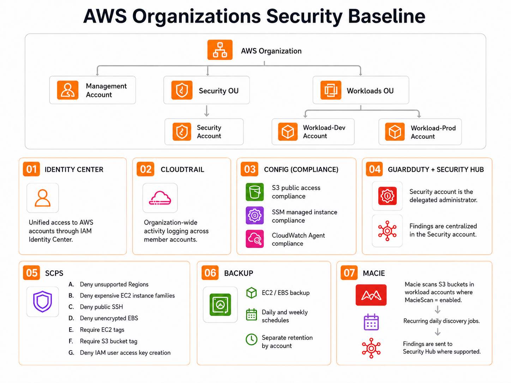

# AWS Organizations Security Baseline

This project defines a Terraform-based AWS Organizations security baseline for a 4-account AWS environment.



## Account Structure

```text
AWS Organization
├── management
├── Security OU
│   └── security
└── Workloads OU
    ├── workload-dev
    └── workload-prod
```

| Account | Purpose |
|---|---|
| `management` | AWS Organizations, IAM Identity Center, OU management, SCP management |
| `security` | Centralized logging, security monitoring, AWS Config aggregation, GuardDuty, Security Hub, Macie |
| `workload-dev` | Development workloads |
| `workload-prod` | Primary workloads |

## Prerequisites

### Terraform Role Chain

Terraform should run with credentials that can assume `management_account_role_arn`.

That management role must be able to:

- manage Organizations, SCPs, delegated admins, and Identity Center
- assume Terraform execution roles in security, workload-dev, and workload-prod

Each member account must have a Terraform execution role that trusts `management_account_role_arn`.

Expected chain:

```text
runner credentials -> management_account_role_arn -> member account execution roles
```

Policy names and scopes are listed below.

## Role Setup

Role names used by Terraform:

- Management: `TerraformManagementExecutionRole`
- Members: `TerraformMemberExecutionRole`

### Policy Setup

Create the policies in the account where the matching role will live.

#### Management Account

Create one IAM policy:

- `TerraformManagementExecutionPolicy`

Steps:

1. Sign in to the management account.
2. Open IAM > Policies > Create policy.
3. Select JSON.
4. Paste this policy.
5. Replace the member account ID placeholders.
6. Select Next.
7. Name it `TerraformManagementExecutionPolicy`.
8. Select Create policy.

```json
{
  "Version": "2012-10-17",
  "Statement": [
    {
      "Effect": "Allow",
      "Action": "sts:AssumeRole",
      "Resource": [
        "arn:aws:iam::<security-account-id>:role/TerraformMemberExecutionRole",
        "arn:aws:iam::<workload-dev-account-id>:role/TerraformMemberExecutionRole",
        "arn:aws:iam::<workload-prod-account-id>:role/TerraformMemberExecutionRole"
      ]
    },
    {
      "Effect": "Allow",
      "Action": [
        "organizations:DescribeOrganization",
        "organizations:ListRoots",
        "organizations:ListAccounts",
        "organizations:ListAccountsForParent",
        "organizations:ListOrganizationalUnitsForParent",
        "organizations:EnableAWSServiceAccess",
        "organizations:ListAWSServiceAccessForOrganization",
        "organizations:EnablePolicyType",
        "organizations:ListPolicies",
        "organizations:CreatePolicy",
        "organizations:UpdatePolicy",
        "organizations:DescribePolicy",
        "organizations:AttachPolicy",
        "organizations:DetachPolicy",
        "organizations:ListTargetsForPolicy",
        "organizations:ListPoliciesForTarget",
        "cloudtrail:CreateTrail",
        "cloudtrail:UpdateTrail",
        "cloudtrail:GetTrail",
        "cloudtrail:DescribeTrails",
        "cloudtrail:GetTrailStatus",
        "cloudtrail:StartLogging",
        "cloudtrail:PutEventSelectors",
        "guardduty:EnableOrganizationAdminAccount",
        "guardduty:ListOrganizationAdminAccounts",
        "securityhub:EnableOrganizationAdminAccount",
        "securityhub:ListOrganizationAdminAccounts",
        "macie2:EnableOrganizationAdminAccount",
        "macie2:ListOrganizationAdminAccounts",
        "sso:*",
        "identitystore:DescribeUser",
        "identitystore:GetUserId",
        "identitystore:CreateUser",
        "identitystore:DeleteUser"
      ],
      "Resource": "*"
    }
  ]
}
```

#### Security Account

Create one IAM policy:

- `TerraformSecurityExecutionPolicy`

Steps:

1. Switch to the security account.
2. Open IAM > Policies > Create policy.
3. Select JSON.
4. Paste this policy.
5. Select Next.
6. Name it `TerraformSecurityExecutionPolicy`.
7. Select Create policy.

```json
{
  "Version": "2012-10-17",
  "Statement": [
    {
      "Effect": "Allow",
      "Action": [
        "s3:*",
        "kms:*",
        "config:*",
        "guardduty:*",
        "securityhub:*",
        "macie2:*",
        "iam:CreateServiceLinkedRole"
      ],
      "Resource": "*"
    }
  ]
}
```

#### Workload-Dev Account

Create two IAM policies:

- `TerraformWorkloadBaselineExecutionPolicy`
- `TerraformWorkloadDevTestPolicy`

Steps for `TerraformWorkloadBaselineExecutionPolicy`:

1. Switch to the workload-dev account.
2. Open IAM > Policies > Create policy.
3. Select JSON.
4. Paste this policy.
5. Select Next.
6. Name it `TerraformWorkloadBaselineExecutionPolicy`.
7. Select Create policy.

```json
{
  "Version": "2012-10-17",
  "Statement": [
    {
      "Effect": "Allow",
      "Action": [
        "config:*",
        "lambda:*",
        "logs:*",
        "guardduty:*",
        "securityhub:*",
        "macie2:*",
        "backup:*",
        "iam:CreateRole",
        "iam:DeleteRole",
        "iam:GetRole",
        "iam:ListRolePolicies",
        "iam:ListAttachedRolePolicies",
        "iam:PutRolePolicy",
        "iam:DeleteRolePolicy",
        "iam:AttachRolePolicy",
        "iam:DetachRolePolicy",
        "iam:TagRole",
        "iam:UntagRole",
        "iam:PassRole",
        "iam:CreateServiceLinkedRole"
      ],
      "Resource": "*"
    }
  ]
}
```

Steps for `TerraformWorkloadDevTestPolicy`:

1. Stay in the workload-dev account.
2. Open IAM > Policies > Create policy.
3. Select JSON.
4. Paste this policy.
5. Select Next.
6. Name it `TerraformWorkloadDevTestPolicy`.
7. Select Create policy.

```json
{
  "Version": "2012-10-17",
  "Statement": [
    {
      "Effect": "Allow",
      "Action": [
        "ec2:Describe*",
        "ec2:RunInstances",
        "ec2:TerminateInstances",
        "ec2:CreateTags",
        "ec2:DeleteTags",
        "ec2:CreateSecurityGroup",
        "ec2:DeleteSecurityGroup",
        "ec2:AuthorizeSecurityGroupEgress",
        "s3:*",
        "iam:CreateRole",
        "iam:DeleteRole",
        "iam:GetRole",
        "iam:AttachRolePolicy",
        "iam:DetachRolePolicy",
        "iam:CreateInstanceProfile",
        "iam:DeleteInstanceProfile",
        "iam:AddRoleToInstanceProfile",
        "iam:RemoveRoleFromInstanceProfile",
        "iam:TagRole",
        "iam:PassRole"
      ],
      "Resource": "*"
    }
  ]
}
```

#### Workload-Prod Account

Create one IAM policy:

- `TerraformWorkloadBaselineExecutionPolicy`

Steps:

1. Switch to the workload-prod account.
2. Open IAM > Policies > Create policy.
3. Select JSON.
4. Paste the same `TerraformWorkloadBaselineExecutionPolicy` JSON used for workload-dev.
5. Select Next.
6. Name it `TerraformWorkloadBaselineExecutionPolicy`.
7. Select Create policy.

### Management Role

1. Open IAM > Roles > Create role.
2. Select Custom trust policy.
3. Paste this trust policy, replacing `<management-account-id>` and `<runner-role-name>`.

Use the IAM role/user ARN, not the temporary STS assumed-role session ARN.

```json
{
  "Version": "2012-10-17",
  "Statement": [
    {
      "Effect": "Allow",
      "Principal": {
        "AWS": "arn:aws:iam::<management-account-id>:role/<runner-role-name>"
      },
      "Action": "sts:AssumeRole"
    }
  ]
}
```

4. Attach this customer-managed policy:
   - `TerraformManagementExecutionPolicy`
5. Name the role `TerraformManagementExecutionRole`.

### Member Roles

Repeat in security, workload-dev, and workload-prod.

1. Open IAM > Roles > Create role.
2. Select Custom trust policy.
3. Paste this trust policy, replacing `<management-account-id>`.

```json
{
  "Version": "2012-10-17",
  "Statement": [
    {
      "Effect": "Allow",
      "Principal": {
        "AWS": "arn:aws:iam::<management-account-id>:role/TerraformManagementExecutionRole"
      },
      "Action": "sts:AssumeRole"
    }
  ]
}
```

4. Attach the customer-managed policy for that account:
   - security: `TerraformSecurityExecutionPolicy`
   - workload-dev: `TerraformWorkloadBaselineExecutionPolicy`
   - workload-dev test resources: `TerraformWorkloadDevTestPolicy`
   - workload-prod: `TerraformWorkloadBaselineExecutionPolicy`
5. Name the role `TerraformMemberExecutionRole`.

If a role already exists: IAM > Roles > select role > Trust relationships > Edit trust policy.

### Terraform Variables

Create one root `terraform.tfvars` file and pass it from each module folder.

```bash
terraform plan -var-file=../terraform.tfvars
terraform apply -var-file=../terraform.tfvars
```

Example:

```hcl
management_account_role_arn = "arn:aws:iam::<management-account-id>:role/TerraformManagementExecutionRole"

security_account_id      = "<security-account-id>"
workload_dev_account_id  = "<workload-dev-account-id>"
workload_prod_account_id = "<workload-prod-account-id>"

user1 = {
  user_name    = "security-admin-user"
  display_name = "Security Admin User"
  given_name   = "Security"
  family_name  = "Admin"
  email        = "security-admin@example.com"
}

user2 = {
  user_name    = "workload-admin-user"
  display_name = "Workload Admin User"
  given_name   = "Workload"
  family_name  = "Admin"
  email        = "workload-admin@example.com"
}
```

## Baseline Components

| Component | Purpose |
|---|---|
| IAM Identity Center | Unified access to AWS accounts through IAM Identity Center |
| CloudTrail | Organization-wide activity logging across member accounts |
| AWS Config | Compliance checks for S3, SSM managed instances, CloudWatch Agent expectations, and required tags |
| GuardDuty | Threat detection across workload accounts |
| Security Hub | Centralized security findings in the security account |
| SCPs | Preventive guardrails for workload accounts |
| AWS Backup | EC2/EBS backup based on tags |
| Macie | Targeted S3 sensitive data discovery based on tags |

## 00-organization

AWS Organizations is used to centrally manage multiple AWS accounts under one organization. It provides account grouping through Organizational Units, centralized governance through Service Control Policies, and a consistent structure for separating security and workload responsibilities.

This baseline assumes the following accounts already exist and are already part of the AWS Organization:

```text
management
security
workload-dev
workload-prod
```

These accounts are prerequisites. Terraform references the existing organization, OUs, and accounts; it does not create new AWS accounts or invitations.

## 01-identity-center

IAM Identity Center provides unified access to AWS accounts through IAM Identity Center.

It is used to avoid creating separate IAM users in each AWS account. Users sign in once, then access assigned AWS accounts using temporary credentials and account-specific permissions.

Permission sets:

| Permission Set | Account |
|---|---|
| `OrganizationAdmin` | `management` |
| `SecurityAdmin` | `security` |
| `WorkloadDevAdmin` | `workload-dev` |
| `WorkloadProdAdmin` | `workload-prod` |

## 02-cloudtrail

Centralized CloudTrail logging records AWS account activity across the organization.

CloudTrail helps answer who performed an action, what action was performed, when it happened, and from where. Sending logs to the `security` account keeps audit records separate from workload accounts.

Configured items include:

- Organization-level CloudTrail
- Multi-Region trail
- Management events
- Read and write events
- Log file validation
- Central log storage in the `security` account
- SSE-KMS encryption
- S3 versioning
- S3 Block Public Access

## 03-config

AWS Config records resource configuration and evaluates resources against compliance rules.

It is used to identify configuration drift, missing controls, and non-compliant resources across workload accounts. The `security` account provides the central compliance view.

Checks:

- S3 buckets should have Block Public Access enabled
- EC2 instances expected to use Systems Manager should be managed by SSM
- EC2 instances expected to use CloudWatch Agent should report CloudWatch Agent compliance
- Required EC2 and S3 tags should use approved values

## 04-guardduty-securityhub

GuardDuty provides threat detection for AWS accounts. It analyzes signals such as CloudTrail events, DNS activity, VPC Flow Logs, EKS audit logs, S3 activity, and other supported data sources to identify suspicious behavior.

Security Hub centralizes security findings and posture results. It provides one place to review findings from GuardDuty, AWS Config, and supported security services from the `security` account.

Included:

- GuardDuty
- Security Hub
- AWS Foundational Security Best Practices

## 05-scps

Service Control Policies define preventive guardrails for accounts in the Workloads OU.

SCPs do not grant permissions. They define the maximum allowed permissions for affected accounts. They are used to prevent risky actions even if a user or role has broad IAM permissions inside a workload account.

Guardrails:

- Deny unsupported Regions
- Deny expensive EC2 instance families
- Deny public SSH
- Deny unencrypted EBS
- Require EC2 tags
- Require S3 bucket tag
- Deny IAM user access key creation

## Required Tags

### EC2 Tags

| Tag | Allowed Values | Purpose |
|---|---|---|
| `SSMManaged` | `enabled`, `disabled` | Defines whether the instance is expected to be managed by Systems Manager |
| `CloudWatchAgent` | `enabled`, `disabled` | Defines whether the instance is expected to have CloudWatch Agent compliance |
| `Backup` | `daily`, `weekly`, `disabled` | Defines backup selection |

### S3 Tags

| Tag | Allowed Values | Purpose |
|---|---|---|
| `MacieScan` | `enabled`, `disabled` | Defines whether the bucket is included in Macie discovery jobs |

## 06-backup

AWS Backup provides centralized backup management for supported AWS resources.

This baseline uses AWS Backup for EC2/EBS backup selection through tags.

| Tag | Behavior |
|---|---|
| `Backup = daily` | Included in daily backup plan |
| `Backup = weekly` | Included in weekly backup plan |
| `Backup = disabled` | Excluded from backup plans |

## 07-macie

Macie discovers sensitive data in S3 buckets.

This baseline uses tag-based selection so only intended buckets are included in discovery jobs.

| Tag | Behavior |
|---|---|
| `MacieScan = enabled` / `MacieScan = disabled` | `enabled` includes the bucket in recurring daily discovery jobs; `disabled` excludes the bucket |

Findings are sent to Security Hub where supported.
